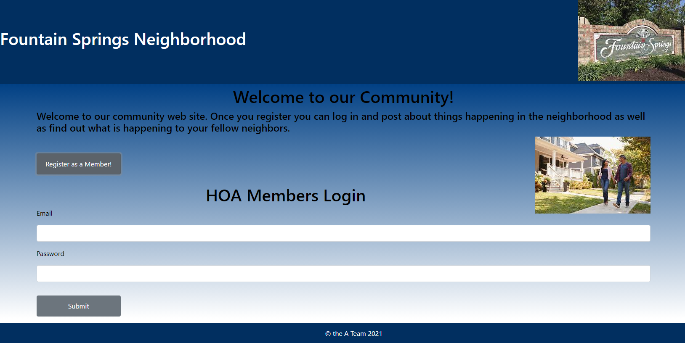
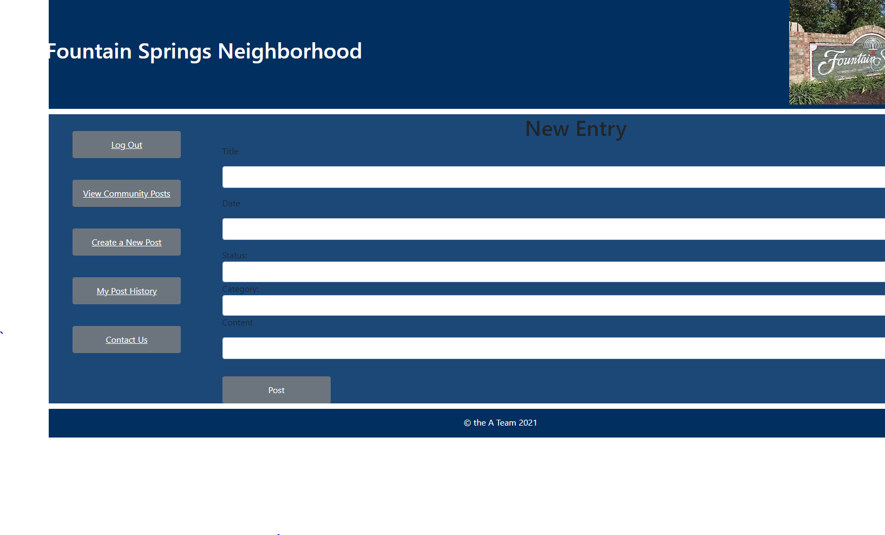
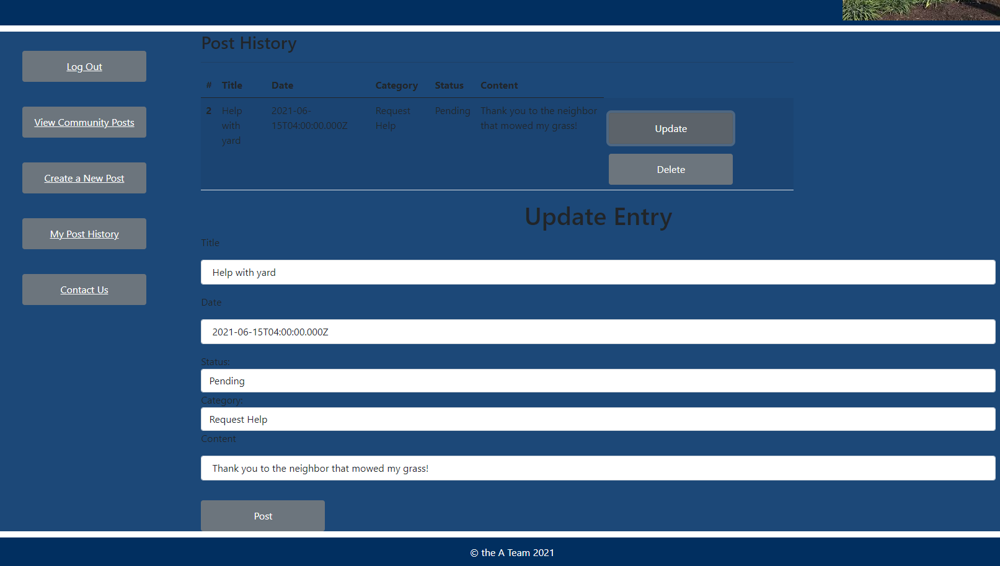
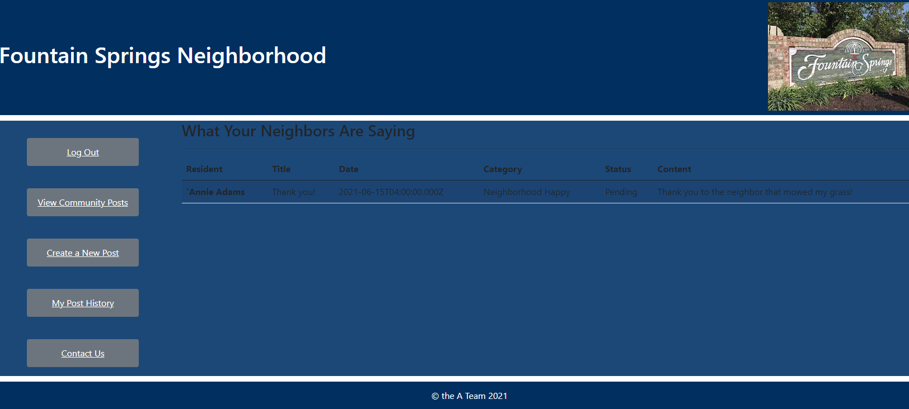
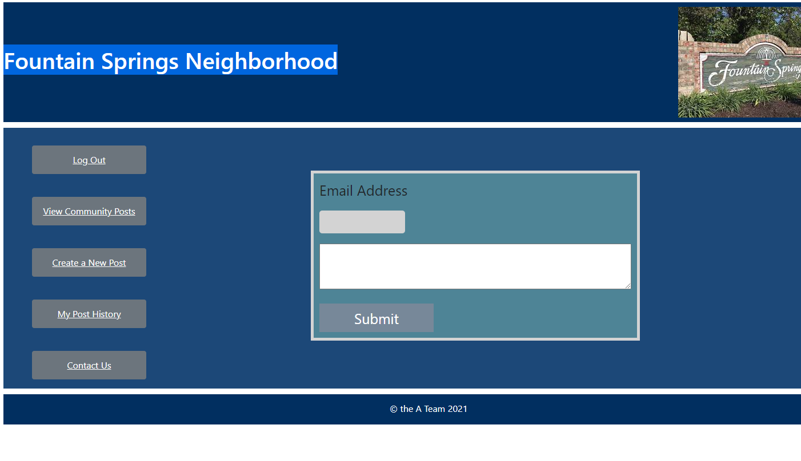

# We are Team-A and we built an HOA Website for our Blue Badge Challenge at Eleven Fifty Academy.

## Project Description: 

This is a website that allows residents of the neighborhood can submit complaints or feedback and view posts from other users in the community. The Admins of the HOA can set complaints as resolved, or remove a post if it is inappropriate.
 
### Here are two User-Stories that we focused on:

 1.) As a member of the HOA for my neighborhood, I would like a way to see complaints and feedback from residents. Having an easy way to sort through these, and mark complaints as resolved would be helpful. I would also want to be able to remove content if it is inappropriate since the whole neighborhood would have access to what is posted here. 

2.) As a resident, I would like to be able to see feedback about my neighborhood so I can keep track of events, and concerns about where I live. I would also like to be able to make my own posts in order to help improve the neighborhood and give some insight to the HOA in charge. 

#### Stretch Goals: Adding in a calendar for neighborhood events.

## Tools Used:

@ Heroku
@ Postgres SQL
@ Postman
@ VScode
@ Programing languages (HTML,CSS, React.js)

## Challenges: 

Deploying the app to Heroku was very challenging. We were unable to retrieve the database. Then Heroku could'nt find our repo.

## Screenshots:

